# Science and Nature Quiz

[Science and Nature Quiz](https://lyd-w.github.io/Science-and-Nature-Quiz/ "Science and Nature Quiz Homepage")

The Science and Nature Quiz is a great way for science and nature enthusiasts to test their knowledge in a fun way, it has three difficulty levels so it's also suited for students, parents, educators and the general public to challenge themselves, as well as offering the potential to learn something new. The website includes instructions on how to take part in the quiz and gives users the opportunity to contact the website to leave feedback, identify issues or with general enquires. The website has been designed to offer a smooth and responsive experience, focusing on providing an enjoyable user experience across multiple devices.

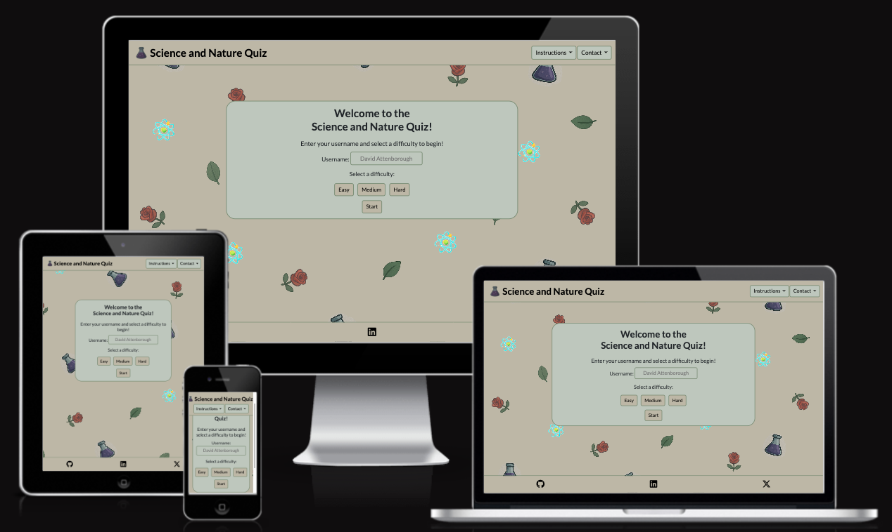

### [Contents](#contents)
* [User Goals](#user-goals)
* [User Stories](#user-stories)
* [User Feedback](#user-feedback)
* [Website Goals and Objectives](#website-goals-and-objectives)
* [Target Audience](#target-audience) 
* [Wireframes](#wireframes)
* [Design Choices](#design-choices)
    + [Typography](#typography)
    + [Colour Scheme](#colour-scheme)
    + [Images](#images)
    + [Responsiveness](#responsiveness)
* [Features](#features)
    * [Existing Features](#existing-features)
        + [Header](#header)
        + [Home Section](#home-section)
        + [Instructions Section](#instructions-section)
        + [Contact Section](#contact-section)
        + [Success Page](#success-page)
        + [Quiz Section](#quiz-section)
        + [Results Section](#results-section)
        + [404 Error Page](#404-error-page)
        + [Footer](#footer)
    * [Future Enhancements](#future-enhancements)
* [Technologies Used](#technologies-used)
    * [Languages](#languages)
    * [Libraries and Frameworks](#libraries-and-frameworks)
    * [Tools and Programmes](#tools-and-programmes)
* [Testing](#testing)
    * [Bugs](#bugs)
    * [Responsiveness Tests](#responsiveness-tests)
    * [Code Validation](#code-validation)
        + [HTML](#html)
        + [CSS](#css)
        + [JavaScript](#javascript)
    * [User Story Testing](#user-story-testing)
    * [Feature Testing](#feature-testing)
    * [Accessibility Testing](#accessibility-testing)
    * [Lighthouse Testing](#lighthouse-testing)
    * [Browser Testing](#browser-testing)
* [Deployment](#deployment)
* [Credits](#credits)

## User Goals

* User friendly navigation.
* Clear instructions.
* Science and nature based questions.
* Ability to provide feedback, identify issues or submit a general enquiry.
* Timer for each question.
* Display the users score.
* Different levels of difficulty.
* Have multiple choice questions.

[Back to contents](#contents)

## User Stories

* As a user, I want my knowledge on science and nature to be tested in a fun way.
* As a user, I want to contact the website for feedback, issues or general enquiries.
* As a user, I want to be able to access the quiz on a range of devices.
* As a user, I want different levels of difficulty of the quiz.
* As a user, I want an up to date score.
* As a user, I want to be able to find clear instructions easily.
* As a user, I want multiple choice questions.

[Back to contents](#contents)

## User Feedback

During the later development stages of the Science and Nature Quiz website, I asked friends and family to test the website on as many different devices as possible to find potential improvements for the website as well as possible glitches.

The quiz received positive feedback with a few minor tweaks being needed, such as an issue with the hover feature when played on mobile as listed in the bug section of testing.

[Back to contents](#contents)

## Website Goals and Objectives

* Provide an entertaining way to test and educate the user.
* Include a mix of science and nature based, multiple choice questions.
* Encourage users to expand their science and nature knowledge.
* Offer interesting and accurate information.
* Encourage interactivity with the website.
* Provide the option for users to leave feedback, report issues or submit general enquiries.

[Back to contents](#contents)

## Target Audience

* Science enthusiasts
* Nature enthusiasts
* Students
* Educators
* Parents
* General public

[Back to contents](#contents)

## Wireframes

The wireframes were designed using templates from [Balsamiq](https://balsamiq.com/ "Balsamiq Homepage"). I started with the mobile version, then tablet and finished with the desktop display. 

[Mobile Wireframes](docs/mobile-wireframes.pdf "Mobile Wireframes")

[Tablet Wireframes](docs/tablet-wireframes.pdf "Tablet Wireframes")

[Desktop Wireframes](docs/desktop-wireframes.pdf "Laptop Wireframes")

[Back to contents](#contents)

## Design Choices

### Typography

The font family that has been chosen for the Science and Nature Quiz is [Lato](https://fonts.google.com/specimen/Lato "Google Fonts | Lato") due to its readability through its clean letter design and professional yet friendly appearance which gives better legibility. Given that the quiz will have questions to read, legibility of the font is an important factor to increase the user experience.

### Colour Scheme

For the website background, I created some science and nature styled icons using [ChatGPT](https://chatgpt.com/ "ChatGPT Homepage") and placed them over a neutral background using [Adobe Photoshop](https://www.adobe.com/uk/products/photoshop.html "Adobe | Photoshop") which created some of the base colours for the website. I then included greens to help create a calm atmosphere while linking to science and nature. I used [Coolors Scheme](https://coolors.co/ "Coolors Scheme Homepage") to finalise the chosen colours and visualise them next to each other.

I then used [Contrast Grid](https://contrast-grid.eightshapes.com/?version=1.1.0&background-colors=&foreground-colors=%23BCB7A4%0D%0A%23BEC7BC%0D%0A%2376896E%0D%0A%23000000%0D%0A%23FFFFFF&es-color-form__tile-size=compact&es-color-form__show-contrast=aaa&es-color-form__show-contrast=aa&es-color-form__show-contrast=aa18&es-color-form__show-contrast=dnp "Contrast Grid") to determine the best colour combinations to ensure the website will be visually appealing whilst remaining easy for the user to read the quiz questions and answers.

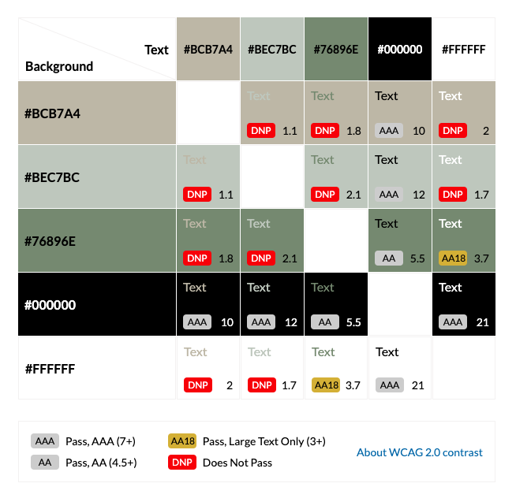

|CSS Name               |HEX          |Use
|-----------------------|-------------|------------------------------------------------|
| --primary | #BCB7A4 | Website background colour and buttons |
| --secondary | #BEC7BC | Section background colour for instructions, contact and quiz  |
| --highlight | #79896E | Button hover and borders |
| --text-dark | #000000 | Primary text colour |
| --text-light | #FFFFFF | Secondary text colour |

Other required colours:

|CSS Name               |HEX          |Use
|-----------------------|-------------|------------------------------------------------|
| --incorrect | #FF0000 | Incorrect answers |
| --correct | #2E6F40 | Correct answers |

### Images

The logo design and icons for the background have been created by [ChatGPT](https://chatgpt.com/ "ChatGPT Homepage"), to remain related to the quiz topic I went for science and nature themed icons. I then used [Adobe Photoshop](https://www.adobe.com/uk/products/photoshop.html "Adobe | Photoshop") to style the icons onto the chosen background colour to keep it in style with the website whilst creating a more interesting and fun feature to the website's background without taking focus from the quiz. 

### Responsiveness

The website is responsive to different screen sizes with the breakpoints taken from [Bootstrap](https://getbootstrap.com/docs/5.3/layout/breakpoints/#available-breakpoints "Bootstrap Breakpoints"). There are media queries added to the CSS to determine the correct media query for different viewpoints, establishing a consistent level of user experiences over different devices.

[Back to contents](#contents)

# Features

An interactive, multiple choice quiz website with a topic focus of science and nature and different difficulty levels, that is responsive over a range of devices. The user can easily find the instructions on how the quiz works at the top of the page, as well as the contact form to provide any feedback or comments regarding the website. After completing the quiz, a persistent scoreboard of up to 5 highscores is displayed to encourage light hearted competition between friends and family or to encourage self-improvement. The user then has the option to start a 'New Game' where a new username can be assigned for the player, to 'Retry' to better their current scores or to view the current highscores.

## Existing Features

### Header

The website has consistent headers on all devices, showing the quiz name in the header font along with the quiz logo. Buttons for the instructions and contact can also be found within the header, both of which have dropdown contents to provide further information or access to the contact form.

<b>Mobile header</b>

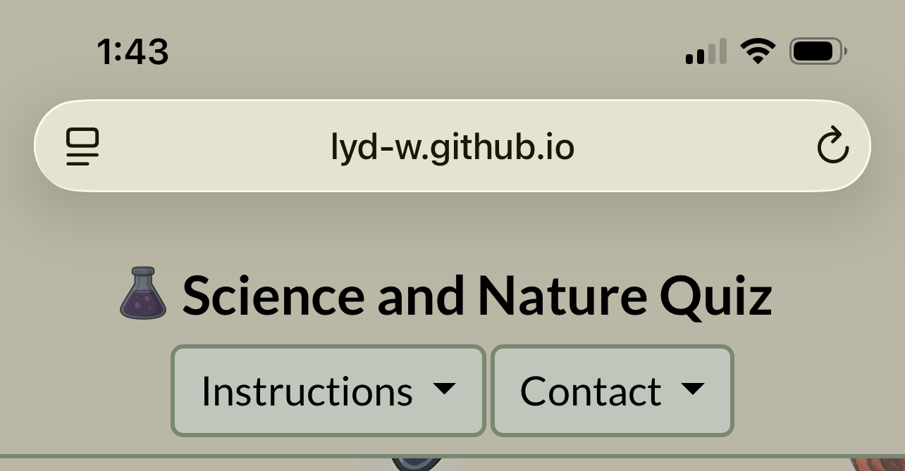

 

 

 

<b>Tablet header</b>

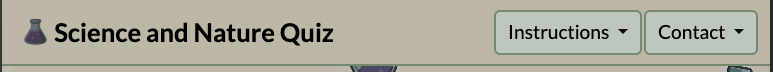

 

 

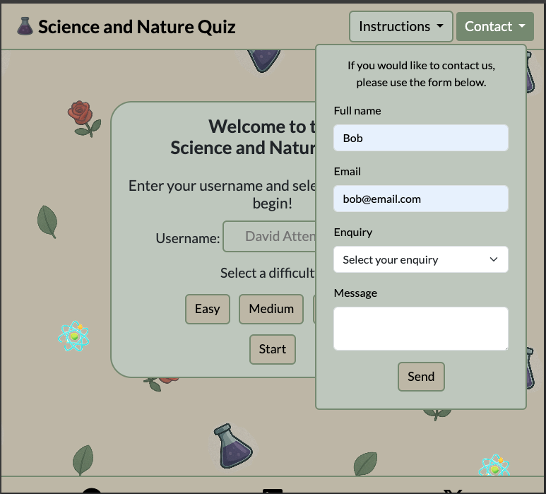

 

<b>Desktop header</b>

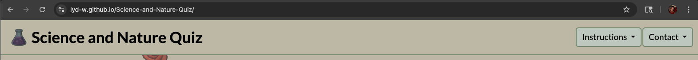

 

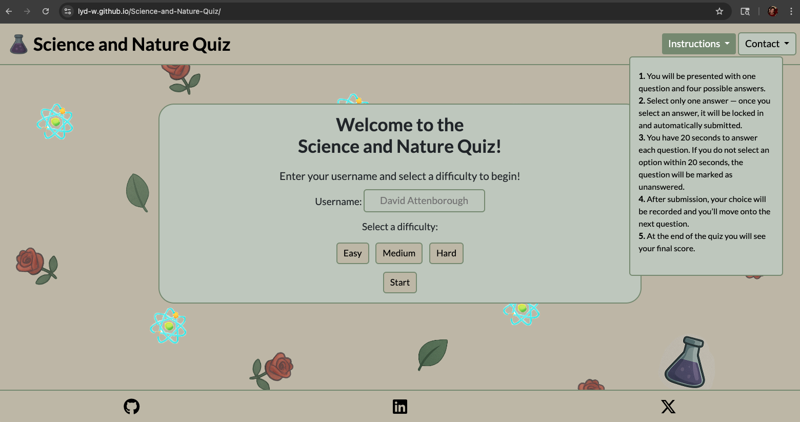

 

 

### Home Section

The home view features the quiz's name and logo in the header of the webpage, along with the instructions and contact form. In the center of the screen, the user will find the setup section of the quiz ready for them to enter their username, select a difficulty, easy, medium and hard, then they can start the quiz.

 

### Instructions Section

The instructions to the quiz can be found using the dropdown menu at the top of the screen. On tablets and larger screens, it shows in the top right corner, for mobile devices it fills the screen more to ensure easier readability.

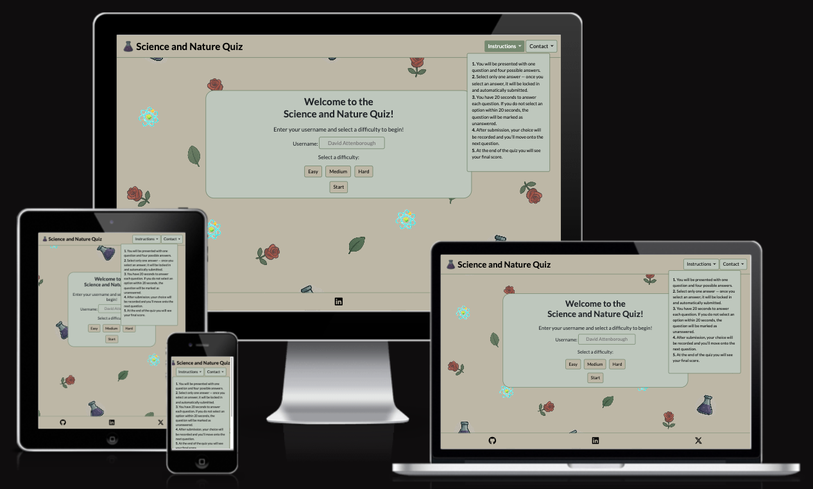

 

### Contact Section

The contact form to the quiz can be found using the dropdown menu at the top of the screen. On tablets and larger screens it shows in the top right corner, for mobile devices it fills the screen more to ensure easier readability.

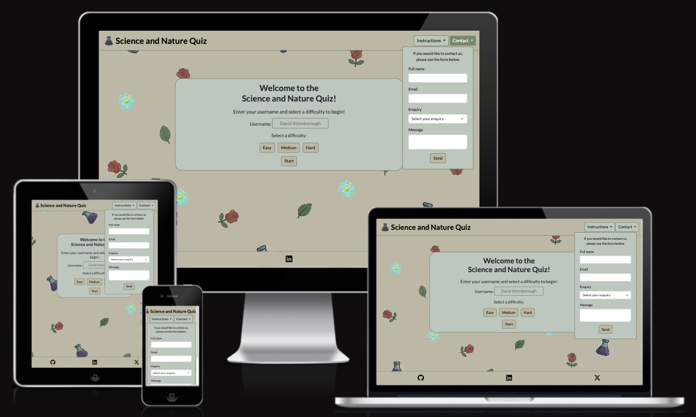

 

Each field has the prompt "Please fill in this field" that is required before submission of the form can go ahead, this ensures all required information is completed correctly by the user.

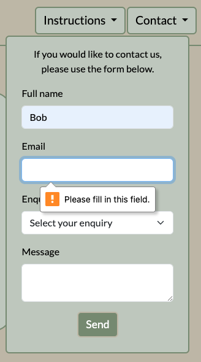

 

### Success Page

The website includes a Success page to give the user feedback regarding the status of their contact enquiry when the form has been filled in correctly.

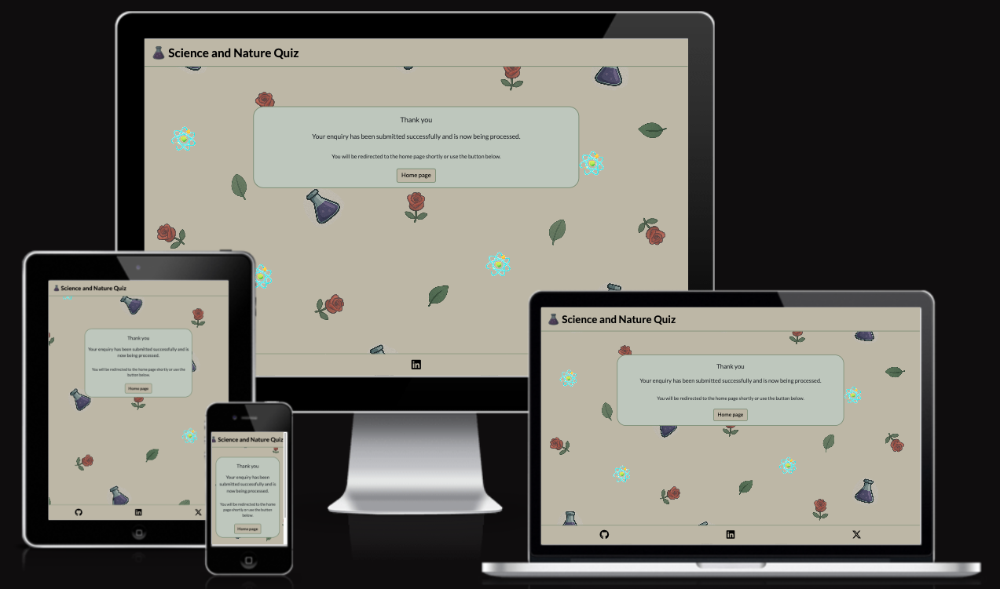

 

### Quiz Section

While loading the questions, there is a circular loading animation that pops up with 'Loading questions...' to keep the user informed so there is no confusion over whether the website is working correctly or not.

The quiz section lists the question number at the top of the quiz container, stating which question out of 10 the user is on. I displayed how many correct and incorrect answers the user has so far, the time remaining counting down from 20 seconds and the question with 4 possible answers.

When using a mouse or tabbing over the questions, a highlight effect is used to help the user see where they're selecting. If they select the correct answer, the answer turns green, however, if they select an incorrect answer, the chosen answer turns red and the correct answer turns green. If the user runs out of time before selecting an answer, the correct answer turns green.

Once an answer has been selected or the timer has run out, there is a short delay before moving onto the next question or, at the end of the quiz, to the results section.

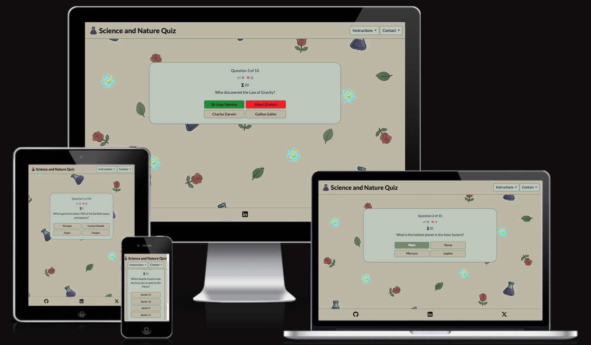

 

### Results Section

The results section displays the user's final score in large text along with the options of 'New Game' where they can begin a new game from scratch, including choosing a new username and difficulty, 'Retry' where they can keep their username and difficulty level the same but go onto 10 new questions or they can select 'High scores' where up to 5 high scores are displayed along with the username of who achieved each score.

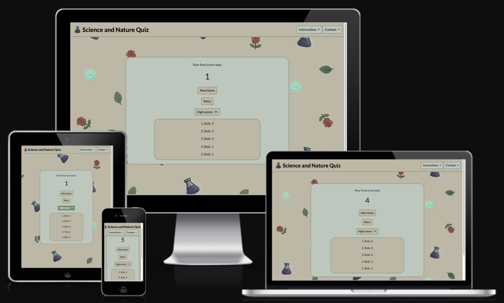

 

 

### 404 Error Page

If the user happens to go to an incorrect URL of the website, a 404 error page has been set up to inform the user of the situation and automatically redirect them back to the home page, or they have the option to use the 'Home page' button for a quicker return to the quiz.

 

### Footer

The footer follows a consistent style across all devices, using the same background colour as the navbar with black icons. The footer contains social media links for GitHub, LinkedIn and X that can be linked to the quiz creator's social media channel with each link opening in a new window.

<b>Mobile footer view</b>

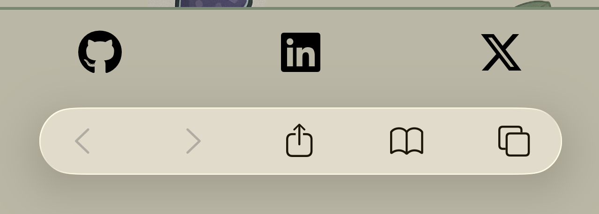

 

<b>Tablet footer view</b>

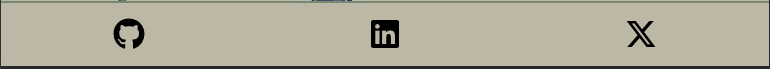

 

<b>Desktop footer view</b>

  

## Future Enhancements

* Additional questions
* Additional topics
* Multi-player 
* Adjustable timer
* Player forum
* Include overall time on high scores

[Back to contents](#contents)

# Technologies Used

## Languages

- [HTML](https://developer.mozilla.org/en-US/docs/Web/HTML "HTML")
- [CSS](https://developer.mozilla.org/en-US/docs/Web/CSS "CSS")
- [JavaScript](https://developer.mozilla.org/en-US/docs/Web/JavaScript "JavaScript")

## Libraries and Frameworks

- [Bootstrap v5.3](https://getbootstrap.com/ "Bootstrap v5.3 Homepage")
- [Favicon](https://favicon.io/ "Favicon Homepage")
- [Font Awesome](https://fontawesome.com/search?q=menu&o=r&ic=free "Font Awesome Homepage")
- [Google Fonts](https://fonts.google.com/ "Google Fonts Homepage")

## Tools and Programmes

- [Adobe Photoshop](https://www.adobe.com/uk/products/photoshop.html "Adobe | Photoshop")
- [Am I Responsive?](https://ui.dev/amiresponsive?url=https://lyd-w.github.io/Science-and-Nature-Quiz/ "Am I Responsive? | Science and Nature Quiz")
- [Balsamiq](https://balsamiq.com/ "Balsamiq Homepage")
- [Contrast Grid](https://contrast-grid.eightshapes.com/?version=1.1.0&background-colors=&foreground-colors=%23BCB7A4%0D%0A%23BEC7BC%0D%0A%2376896E%0D%0A%23000000%0D%0A%23FFFFFF&es-color-form__tile-size=compact&es-color-form__show-contrast=aaa&es-color-form__show-contrast=aa&es-color-form__show-contrast=aa18&es-color-form__show-contrast=dnp "Contrast Grid")
- [Coolors](http://https://coolors.co/ "Coolors")
- [GitHub](https://github.com "GitHub Homepage")
- [Google Chrome Inspect Mode](https://developer.chrome.com/docs/devtools/inspect-mode "Google Chrome Inspect Mode")
- [JSHint](https://jshint.com/ "JSHint Homepage")
- [Open Trivia Database](https://opentdb.com/ "Open Trivia Database Homepage")
- [Prettier](https://marketplace.visualstudio.com/items?itemName=esbenp.prettier-vscode "Prettier - Code Formatter")
- [Responsive Design Checker](https://responsivedesignchecker.com/ "Responsive Design Checker | Homepage")
- [VS Code](https://code.visualstudio.com/ "VS Code Homepage")
- [W3C CSS Validation Service](https://jigsaw.w3.org/css-validator/#validate_by_input "W3C CSS Validation Service Homepage")
- [W3C HTML Validation Service](https://validator.w3.org/#validate_by_uri "W3C HTML Validation Service Homepage")
- [WAVE](https://wave.webaim.org/report#/https://lyd-w.github.io/Science-and-Nature-Quiz/ "WAVE | Science and Nature Quiz Report")

[Back to contents](#contents)

# Testing

## Bugs

|   Bug Description                         | Resolved |    Resolution Description                               |
|-------------------------------------------|----------|---------------------------------------------------------|
| When the instructions were opened, the container flashed blue briefly as if highlighting the text. | Yes | To resolve this, I changed the anchor tag to a div and removed the dropdown-item class. |
| The contact form would close when 'Send' was selected if all of the form boxes were not completed. | Yes | This was resolved by adding an event listener to the script.js to stop propagation when a click is registered inside the contact form. |
| The required fields message failed to show on the contact form. | Yes | To resolve this I added an event listener for 'submit' in the script.js which prevents the default behaviours, checks the form boxes are filled and displays the correct error message highlighting what information is missing. |
| When the 'tab' key was used to navigate the website, the button highlight style was not applied causing visual difficulties. | Yes | To prevent this issue from happening, I added the focus pseudo class to the buttons and applied the same styling as the hover effect. |
| The above solution created a bug on touch screen devices where the last selected answer, remained highlighted on the new answer list. | Yes | This was resolved by moving the hover pseudo class to only apply to devices with hover enabled and a fine pointer through media queries. |
| When the user started a new game through 'New Game' or 'Retry', the question count continued to increase past 10. | Yes | I created a reset display function in script.js which cleared the data ready for the next game. |
| Some of the questions have unexpected symbols in them. | No | As the questions are pulled from an API, further decoding of the questions would be required to resolve this issue. | 

## Responsiveness Tests

I deployed the website early on in the project to allow for checking the websites responsiveness. I used [Am I Responsive?](https://ui.dev/amiresponsive?url=https://lyd-w.github.io/Science-and-Nature-Quiz "Am I Responsive? | Science and Nature Quiz") and [Responsive Design Checker](https://responsivedesignchecker.com/checker.php?url=https%3A%2F%2Flyd-w.github.io%2FScience-and-Nature-Quiz%2F&width=1400&height=700 "Responsive Design Checker | Science and Nature Quiz") to test how responsive the website was on different screen sizes. I found the website was responsive on all screen sizes.

To check the responsiveness of the website, I thoroughly tested it in Chrome Inspect Mode for Mobile S - 320px, Tablet - 768px, Laptop 1024px and Laptop L - 1440px, on a MacBook Pro in Chrome and Safari as well as on an iPhone 12 Pro Max on Edge and Safari.

## Code Validation

### HTML

I have used [W3C HTML Validation Service](https://validator.w3.org/#validate_by_uri "W3C HTML Validation Service") to validate the HTML used for the website, no errors were returned.

### CSS

I have used [W3C CSS Validation Service](https://jigsaw.w3.org/css-validator/ "W3C CSS Validation Service") to validate the CSS, no errors were returned.

### JavaScript

I have used JSHint to validate the JavaScript code, it found no errors.

## User Story Testing

|User Story                               | Result                                      |Pass| Evidence             |
|-----------------------------------------|---------------------------------------------|----|----------------------|
|As a user, I want my knowledge on science and nature to be tested in a fun way. | The quiz topic focuses on a mix on science and nature questions delivered in a fun, educational manner and encourages light-hearted competition through the use of the scoreboard. | Yes | [Question sample](docs/question.png "Question Sample") [Scoreboard](docs/desktop-results-section.png "Scoreboard") |
|As a user, I want to contact the website for feedback, issues or general enquiries. | There is a contact form displayed on the main pages of the quiz with a dropdown menu of topics. | Yes | [Contact form](docs/contact-section.png "Contact Form") [Contact form dropdown](docs/desktop-header-contact.png "Contact Form Dropdown") |
| As a user, I want to be able to access the quiz on a range of devices. | The quiz has been designed to be used across a range of devices where it is consistently responsive. | Yes | [Range of devices](docs/science-and-nature-quiz-responsive-display.png "Range of Devices") |
| As a user, I want different levels of difficulty of the quiz. | The quiz has three difficulty levels of questions, easy, medium and hard that the user can choose between. | Yes | [Setup section](docs/setup-section.png "Setup Section") |
| As a user, I want an up to date score. | The related score updates each time the user gets an answer correct or incorrect with the results section displaying the user's final score. | Yes | [Score](docs/score.png "Score") [Results section](docs/desktop-results-section.png "Results Section") | 
| As a user, I want to be able to find clear instructions easily. | The instructions can be found at the top of the page on all main pages, they're clearly written for easy understanding by the user. | Yes | [Instructions](docs/instructions-section.png "Instructions") |
| As a user, I want multiple choice questions. | The questions each have the option of four answers, one correct answer and three incorrect answers. | Yes | [Quiz section](docs/quiz-section.png "Quiz Section") |

[Back to contents](#contents)

## Feature Testing

To check the features of the website, I thoroughly tested them in Chrome Inspect Mode for Mobile S - 320px, Tablet - 768px, Laptop 1024px and Laptop L - 1440px, on a MacBook Pro in Chrome and Safari as well as on an iPhone 12 Pro Max on Edge and Safari. The features of the website were fully functional on all devices. I also asked family and friends to explore the website and report any issues or bugs they found, only one bug was found which was logged and resolved.

## Accessibility Testing

I have used [WAVE](https://wave.webaim.org/report#/https://lyd-w.github.io/Science-and-Nature-Quiz/ "WAVE | Science and Nature Quiz Report") to create an accessibility report on the website, no errors were found.

## Lighthouse Testing

The Science and Nature Quiz website has been tested in [Google Chrome Dev Tools](https://developer.chrome.com/docs/devtools/inspect-mode "Google Chrome Dev Tools") using the Lighthouse Testing tool to check:

* Performance - this measures the efficiency of the page loading and running.
* Accessibility - this assesses the usability of the page for all people, especially those with disabilities.
* Best Practices - this checks how the page compares to a set of established web development practices.

The website scored highly on the Lighthouse testing with the lowest score being 94 which is still an acceptable score.

[Lighthouse - desktop main page test](docs/lighthouse-desktop-test.pdf "Lighthouse | Desktop Main Page Test")

[Lighthouse - desktop success page test](docs/lighthouse-desktop-test-success.pdf "Lighthouse | Desktop Success Page Test")

[Lighthouse - desktop 404 error page test](docs/lighthouse-desktop-test-404.pdf "Lighthouse | Desktop 404 Error Page Test")

[Lighthouse - mobile main page test](docs/lighthouse-mobile-test.pdf "Lighthouse | Mobile Main Page Test")

[Lighthouse - mobile success page test](docs/lighthouse-mobile-test-success.pdf "Lighthouse | Mobile Success Page Test")

[Lighthouse - mobile 404 error page test](docs/lighthouse-mobile-test-404.pdf "Lighthouse | Mobile 404 Error Page Test")

## Browser Testing

The website has been tested on a MacBook Pro in Chrome and Safari, it functions as expected with no obvious issues. The website has also been tested on an iPhone 12 Pro Max on Safari and Edge, it functions as expected with no obvious issues.

[Back to contents](#contents)

# Deployment

The Science and Nature Quiz website was deployed on GitHub early on in the development process to highlight any possible issues that could occur. The steps used to deploy the website were as follows:

- Open up the repository on GitHub.
- Select **'Settings'** from the top menu.
- Select **'Pages'** from the menu down the left-hand side.
- Change the **'None'** dropdown menu to **'Main'**.
- Click the **'Save'** button.
- Wait while the website is deployed.
- The website is then live and accessible at: **https://lyd-w.github.io/Science-and-Nature-Quiz/**

Changes can still be made to the website through VS Code, they become live once they have been added, committed and pushed to GitHub. GitHub then lists the different commits that have taken place to show what changes were made and when.

[Back to contents](#contents)

# Credits

#### Feedback, advice and support

- [Simen Daehlin](https://github.com/eventyret "Simen Daehlin")

#### Learning Resources and Guidance

- [Bro Code](https://www.youtube.com/@BroCodez "Bro Code | YouTube")
- [Code Institute](https://codeinstitute.net/ "Code Institute")
- [Conductor](https://www.conductor.com/academy/ "Conductor | Academy")
- [James Murdza](https://www.youtube.com/@jamesmurdza "James Murdza | YouTube")
- [MDN](https://developer.mozilla.org/en-US/ "MDN | Homepage")
- [Slack](https://slack.com/intl/en-gb/ "Slack")
- [Stack Overflow](https://stackoverflow.com/ "Stack Overflow")
- [W3 Schools](https://www.w3schools.com/ "W3 Schools")

#### Information References

#### Images:

- [Adobe Photoshop](https://www.adobe.com/uk/products/photoshop.html "Adobe | Photoshop")
- [ChatGPT](https://chatgpt.com/ "ChatGPT")
- [Favicon.io](https://favicon.io "Favicon.io")

#### Visual Content:

- [Contrast Grid](https://contrast-grid.eightshapes.com/?version=1.1.0&background-colors=&foreground-colors=%23BCB7A4%0D%0A%23BEC7BC%0D%0A%2376896E%0D%0A%23000000%0D%0A%23FFFFFF&es-color-form__tile-size=compact&es-color-form__show-contrast=aaa&es-color-form__show-contrast=aa&es-color-form__show-contrast=aa18&es-color-form__show-contrast=dnp "Contrast Grid")
- [Coolors Scheme](https://coolors.co/ "Coolors Scheme Homepage")

[Back to contents](#contents)

