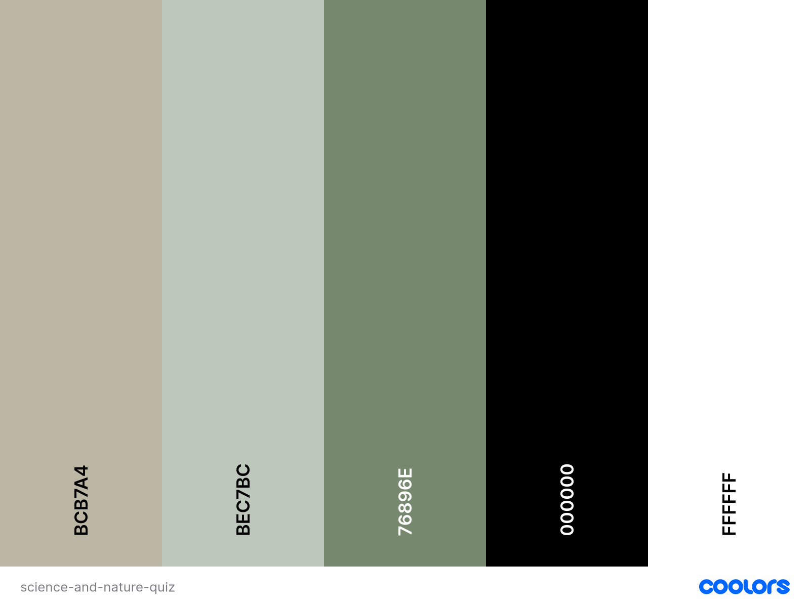

# Science and Nature Quiz

[Science and Nature Quiz](*website link to be added* "Science and Nature Quiz Homepage")

The Science and Nature Quiz is a great way for science and nature enthusiasts to test their knowledge in a fun way, it has three difficulty levels so it's also suited for students, parents, educators and the general public to challenge themselves, as well as offering the potential to learn something new. The website includes instructions on how to take part in the quiz and gives users the opportunity to contact the website to leave feedback, identify issues or with general enquires. The website has been designed to offer a smooth and responsive experience, focusing on providing an enjoyable user experience across multiple devices.

### [Contents](#contents)
* [User Goals](#user-goals)
* [User Stories](#user-stories)
* [User Feedback](#user-feedback)
* [Website Goals and Objectives](#website-goals-and-objectives)
* [Target Audience](#target-audience) 
* [Wireframes](#wireframes)
* [Design Choices](#design-choices)
    + [Typography](#typography)
    + [Colour Scheme](#colour-scheme)
    + [Images](#images)
    + [Responsiveness](#responsiveness)
* [Features](#features)
    * [Existing Features](#existing-features)
        + [Navigation](#navigation)
        + [Header](#header)
        + [Home Section](#home-section)
        + [Welcome Section](#welcome-section)
        + [Admissions Section](#admissions-section)
        + [Parent Information Section](#parent-information-section)
        + [Contact Section](#contact-section)
        + [Success Page](#success-page)
        + [Footer](#footer)
    * [Future Enhancements](#future-enhancements)
* [Technologies Used](#technologies-used)
    * [Languages](#languages)
    * [Libraries and Frameworks](#libraries-and-frameworks)
    * [Tools and Programmes](#tools-and-programmes)
* [Testing](#testing)
    * [Bugs](#bugs)
    * [Responsiveness Tests](#responsiveness-tests)
    * [Code Validation](#code-validation)
        + [HTML](#html)
        + [CSS](#css)
        + [JavaScript](#javascript)
    * [User Story Testing](#user-story-testing)
    * [Feature Testing](#feature-testing)
    * [Accessibility Testing](#accessibility-testing)
    * [Lighthouse Testing](#lighthouse-testing)
    * [Browser Testing](#browser-testing)
* [Deployment](#deployment)
* [Credits](#credits)

## User Goals

* User friendly navigation.
* Clear instructions.
* Science and nature based questions.
* Ability to provide feedback, identify issues or submit a general enquiry.
* Timer for each question.
* Display the users score.
* Different levels of difficulty.
* Have multiple choice questions.

[Back to contents](#contents)

## User Stories

* As a user, I want my knowledge on science and nature to be tested in a fun way.
* As a user, I want to contact the website for feedback, issues or general enquiries.
* As a user, I want to be able to access the quiz on a range of devices.
* As a user, I want different levels of difficulty of the quiz.
* As a user, I want an up to date score.
* As a user, I want to be able to find clear instructions easily.
* As a user, I want multiple choice questions.

[Back to contents](#contents)

## User Feedback

[Back to contents](#contents)

## Website Goals and Objectives

* Provide an entertaining way to test and educate the user.
* Include a mix of science and nature based, multiple choice questions.
* Encourage users to expand their science and nature knowledge.
* Offer interesting and accurate information.
* Encourage interactivity with the website.
* Provide the option for users to leave feedback, report issues or submit general enquiries.

[Back to contents](#contents)

## Target Audience

* Science enthusiasts
* Nature enthusiasts
* Students
* Educators
* Parents
* General public

[Back to contents](#contents)

## Wireframes

The wireframes were designed using templates from [Balsamiq](https://balsamiq.com/ "Balsamiq Homepage"). I started with the mobile version, then tablet and finished with the desktop display. 

[Mobile Wireframes](docs/mobile-wireframes.pdf "Mobile Wireframes")

[Tablet Wireframes](docs/tablet-wireframes.pdf "Tablet Wireframes")

[Desktop Wireframes](docs/desktop-wireframes.pdf "Laptop Wireframes")

[Back to contents](#contents)

## Design Choices

### Typography

The font family that has been chosen for the Science and Nature Quiz is [Red Hat Display](https://fonts.google.com/specimen/Red+Hat+Display "Google Fonts | Red Hat Display") due to its low contrast and tighly spaced design which gives better legibility. Given that the quiz will have questions to read, legibility of the font is an important factor to increase the user experience.

### Colour Scheme

For the website background, I created some science and nature styled icons using [ChatGPT](https://chatgpt.com/ "ChatGPT Homepage") and placed them over a neutral background using [Adobe Photoshop](https://www.adobe.com/uk/products/photoshop.html "Adobe | Photoshop") which created some of the the base colours for the website. I then included greens to help create a calm atmosphere while linking to science and nature. I used [Coolors Scheme](https://coolors.co/ "Coolors Scheme Homepage") to finalise the chosen colours and visualise them next to each other.

I then used [Contrast Grid](https://contrast-grid.eightshapes.com/?version=1.1.0&background-colors=&foreground-colors=%23A09A8A%0D%0A%23D0E5C8%0D%0A%23899F7F%0D%0A%23000000%0D%0A%23FFFFFF&es-color-form__tile-size=compact&es-color-form__show-contrast=aaa&es-color-form__show-contrast=aa&es-color-form__show-contrast=aa18&es-color-form__show-contrast=dnp "Contrast Grid") to determine the best colour combinations to ensure the website will be visually appealing whilst remaining easy for the user to read the quiz questions and answers.

|CSS Name               |HEX          |Use
|-----------------------|-------------|------------------------------------------------|
| --khaki | #A09A8A | Background colour
| --black | #000000 | Text colour |
| --light-green | #D0E5C8 | Button background colour |
| --dark-green | #899F7F | Button borders |
| --white | #FFFFFF |  Highlighting, button hover |

Other required colours:

|CSS Name               |HEX          |Use
|-----------------------|-------------|------------------------------------------------|
| --red | #FF0000 | Incorrect answers |
| --green | #6BC841 | Correct answers |

### Images

### Responsiveness

[Back to contents](#contents)

# Features

## Existing Features

### Navigation

### Header

### Home Section

### Instructions Section

### Contact Section

### Success Page

### Footer

## Future Enhancements

* 

[Back to contents](#contents)

# Technologies Used

## Languages

- [HTML](https://developer.mozilla.org/en-US/docs/Web/HTML "HTML")
- [CSS](https://developer.mozilla.org/en-US/docs/Web/CSS "CSS")
- [JavaScript](https://developer.mozilla.org/en-US/docs/Web/JavaScript "JavaScript")

## Libraries and Frameworks

- [Bootstrap v5.3](https://getbootstrap.com/ "Bootstrap v5.3 Homepage")
- [Favicon](https://favicon.io/ "Favicon Homepage")
- [Font Awesome](https://fontawesome.com/search?q=menu&o=r&ic=free "Font Awesome Homepage")
- [Google Fonts](https://fonts.google.com/ "Google Fonts Homepage")

## Tools and Programmes

- [Balsamiq](https://balsamiq.com/ "Balsamiq Homepage")
- [GitHub](https://github.com "GitHub Homepage")
- [Prettier](https://marketplace.visualstudio.com/items?itemName=esbenp.prettier-vscode "Prettier - Code Formatter")
- [VS Code](https://code.visualstudio.com/ "VS Code Homepage")

[Back to contents](#contents)

# Testing

## Bugs

|   Bug Description                         | Resolved |    Resolution Description                               |
|-------------------------------------------|----------|---------------------------------------------------------|

## Responsiveness Tests

## Code Validation

### HTML

### CSS

### JavaScript

## User Story Testing

|User Story                               | Result                                      |Pass| Evidence             |
|-----------------------------------------|---------------------------------------------|----|----------------------|

[Back to contents](#contents)

## Feature Testing

## Accessibility Testing

## Lighthouse Testing

## Browser Testing

[Back to contents](#contents)

# Deployment

[Back to contents](#contents)

# Credits

#### Feedback, advice and support

- [Simen Daehlin](https://github.com/eventyret "Simen Daehlin")

#### Learning Resources and Guidance

- [Code Institute](https://codeinstitute.net/ "Code Institute")

#### Information References

#### Images:

- [Adobe Photoshop](https://www.adobe.com/uk/products/photoshop.html "Adobe | Photoshop")
- [ChatGPT](https://chatgpt.com/ "ChatGPT")
- [Favicon.io](https://favicon.io "Favicon.io")

#### Visual Content:

- [Contrast Grid](https://contrast-grid.eightshapes.com/?version=1.1.0&background-colors=&foreground-colors=%23A09A8A%0D%0A%23D0E5C8%0D%0A%23899F7F%0D%0A%23000000%0D%0A%23FFFFFF&es-color-form__tile-size=compact&es-color-form__show-contrast=aaa&es-color-form__show-contrast=aa&es-color-form__show-contrast=aa18&es-color-form__show-contrast=dnp "Contrast Grid")
- [Coolors Scheme](https://coolors.co/ "Coolors Scheme Homepage")

[Back to contents](#contents)

